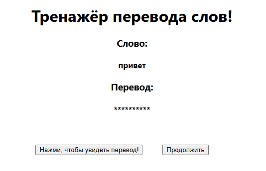
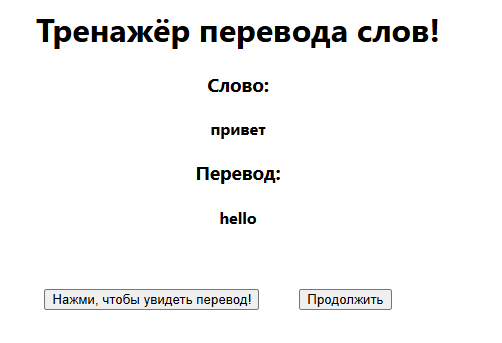
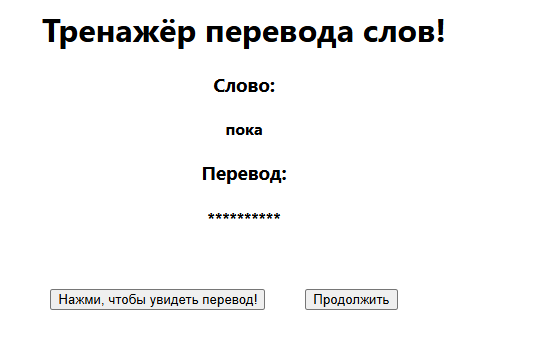

# Тренажёр перевода слов!

## Тренажёр написан на React и выполняет функции скрытия и показа перевода, переход к следующему слову и зацикленность
### Демонстрация работы программы

### Демонстрация скрытия/показа

### Демонстрация перехода к следующему слову

